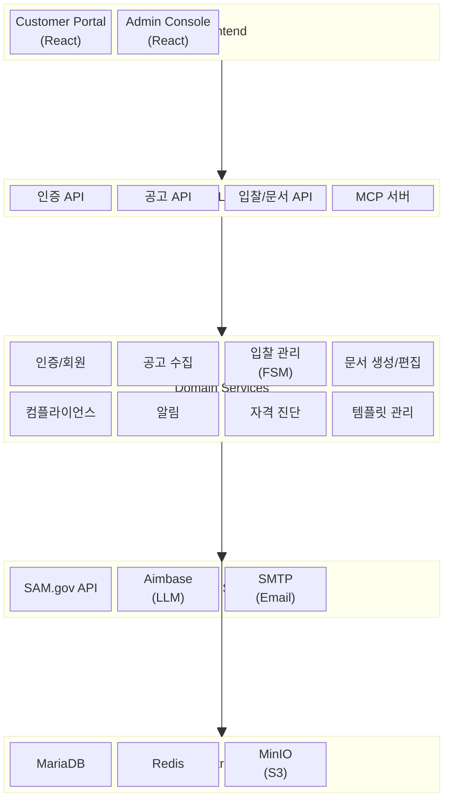
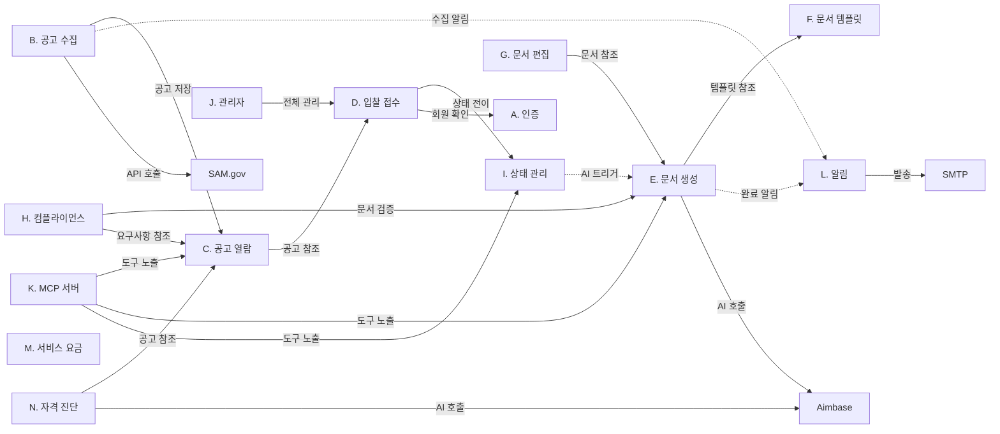

# SAM.gov Bidding Agency Platform 모듈 요약 대시보드

> 설계 버전: 1.0 | 최종 수정: 2026-03-19 | 관련 CR: -

> 프로젝트 전체 구조를 한눈에 파악. Sprint 계획 수립 시 참조.

---

## 시스템 구조도

---

## 모듈 의존 관계도

---

## 모듈 현황

| 모듈 | 기능 수 | MVP 포함 | MVP 제외 | 책임 요약 | 비고 |
|------|--------|---------|---------|----------|------|
| A. 인증 | 4 | 3 | 1 | 회원가입, 로그인, 토큰 관리 | 역할 단순화 (ADMIN/CUSTOMER) |
| B. 공고 수집 | 5 | 3 | 2 | SAM.gov 스케줄/수동 수집, 첨부문서 획득, 알림 | 첨부문서·알림 신규 |
| C. 공고 열람 | 4 | 3 | 1 | 공고 목록/상세, 필요 문서 정리, 북마크 | 필요 문서 표시 신규 |
| D. 입찰 접수 | 4 | 4 | 0 | 입찰 신청, 문서 업로드, 내 입찰 조회 | 고객 접수 단순화 |
| E. 문서 생성 (AI) | 3 | 2 | 1 | AI 제안서 자동 작성, 완료 알림, 버전 관리 | Aimbase 전환 |
| F. 문서 템플릿 | 3 | 2 | 1 | 템플릿 등록/조회/수정 | 다수 포맷 관리 강화 |
| G. 문서 편집 | 3 | 2 | 1 | 관리자 후처리 편집, 잠금, PDF 내보내기 | 에디터 UX 개선 |
| H. 컴플라이언스 | 3 | 0 | 3 | 요구사항-문서 매핑, 충족 검증, BLOCKER 차단 | 이후 확장 |
| I. 상태 관리 | 3 | 1 | 2 | FSM 상태 전이, 이력 조회 | 핵심 전이만 MVP |
| J. 관리자 | 3 | 1 | 2 | 대시보드, 회원 관리, 입찰 관리 | 입찰 관리만 MVP |
| K. MCP 서버 | 4 | 4 | 0 | Aimbase 연동, 공고/문서/상태 Tool | 전체 신규 |
| L. 알림 | 2 | 2 | 0 | 이메일 인프라, 마감일 알림 | 전체 신규 |
| M. 서비스 요금 | 2 | 2 | 0 | 요금 안내, 서비스 단계 선택 | 전체 신규. 결제 연동은 이후 |
| N. 자격 진단 | 2 | 2 | 0 | 입찰 자격 진단, 인증/서류 가이드 | 전체 신규 |
| **합계** | **45** | **31** | **14** | | |
