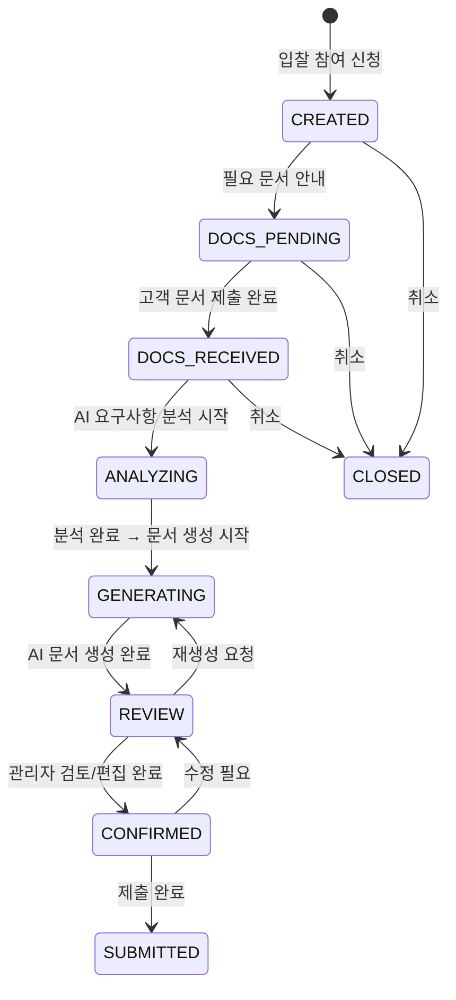
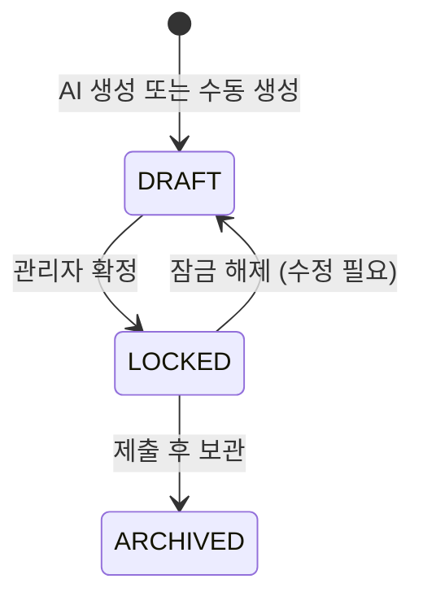

# SAM.gov Bidding Agency Platform FSM 상태 정의

> 설계 버전: 1.0 | 최종 수정: 2026-03-19 | 관련 CR: -

> 단계: 1. Requirements | 설계
>
> 모든 엔티티의 상태 흐름을 여기서 정의한다. 구현 시 상태 전이 검증의 기준이 된다.

## 전체 요약

| 엔티티 | 상태 코드 목록 |
|--------|--------------|
| BidRequest (입찰 요청) | CREATED → DOCS_PENDING → DOCS_RECEIVED → ANALYZING → GENERATING → REVIEW → CONFIRMED → SUBMITTED / CLOSED |
| BidDocument (입찰 문서) | DRAFT → LOCKED → ARCHIVED |

---

## BidRequest (입찰 요청)

### CREATED | 신청 접수
- **설명**: 고객이 공고에 대해 입찰 참여 의사를 밝힌 초기 상태
- **진입 조건**: 고객이 공고 상세에서 "입찰 참여" 클릭 + 서비스 레벨 선택
- **허용 다음 상태**: DOCS_PENDING, CLOSED
- **관련 기능 ID**: BID-REQ-001

### DOCS_PENDING | 문서 대기
- **설명**: 고객에게 필요 문서 안내가 전달되어 문서 제출을 기다리는 상태
- **진입 조건**: 관리자가 필요 문서 체크리스트를 확인/보완 후 고객에게 안내
- **허용 다음 상태**: DOCS_RECEIVED, CLOSED
- **관련 기능 ID**: BID-REQ-002, BID-BROWSE-003

### DOCS_RECEIVED | 문서 접수 완료
- **설명**: 고객이 필요 문서를 모두 제출한 상태
- **진입 조건**: 필수 문서 체크리스트 전부 충족
- **허용 다음 상태**: ANALYZING, CLOSED
- **관련 기능 ID**: BID-REQ-002

### ANALYZING | 분석 중
- **설명**: AI(Aimbase)가 공고 요구사항을 분석하는 상태
- **진입 조건**: 관리자 승인 또는 자동 트리거 (문서 접수 완료 시)
- **허용 다음 상태**: GENERATING
- **관련 기능 ID**: BID-DOC-001
- **비고**: Aimbase Workflow 비동기 실행. 실패 시 관리자에게 알림 후 ANALYZING에 머뭄

### GENERATING | 문서 생성 중
- **설명**: AI(Aimbase)가 제안서를 생성하는 상태
- **진입 조건**: 요구사항 분석 완료
- **허용 다음 상태**: REVIEW
- **관련 기능 ID**: BID-DOC-001
- **비고**: 생성 완료 시 관리자에게 이메일 알림 (BID-DOC-002)

### REVIEW | 관리자 검토
- **설명**: AI가 생성한 문서를 관리자가 검토/편집하는 상태
- **진입 조건**: AI 문서 생성 완료
- **허용 다음 상태**: CONFIRMED, GENERATING
- **관련 기능 ID**: BID-EDIT-001
- **비고**: 재생성이 필요하면 GENERATING으로 복귀 가능

### CONFIRMED | 확정
- **설명**: 관리자가 최종 확인하여 문서가 확정된 상태. 문서 LOCKED 처리
- **진입 조건**: 관리자가 "확정" 처리 + 문서 잠금
- **허용 다음 상태**: SUBMITTED, REVIEW
- **관련 기능 ID**: BID-EDIT-002
- **비고**: 수정이 필요하면 REVIEW로 복귀 가능 (문서 잠금 해제 필요)

### SUBMITTED | 제출 완료
- **설명**: 입찰 서류가 SAM.gov에 제출된 최종 상태
- **진입 조건**: 관리자가 제출 실행
- **허용 다음 상태**: (최종 상태)
- **관련 기능 ID**: BID-FSM-001

### CLOSED | 종료
- **설명**: 입찰이 취소/만료/기타 사유로 종료된 상태
- **진입 조건**: 고객 취소 요청 또는 관리자 종료 처리 또는 공고 마감 초과
- **허용 다음 상태**: (최종 상태)
- **관련 기능 ID**: BID-FSM-001

---

## BidDocument (입찰 문서)

### DRAFT | 초안
- **설명**: 문서가 편집 가능한 상태
- **진입 조건**: AI 생성 완료 또는 관리자 수동 생성
- **허용 다음 상태**: LOCKED
- **관련 기능 ID**: BID-DOC-001, BID-EDIT-001

### LOCKED | 잠금
- **설명**: 문서가 확정되어 편집 불가 상태
- **진입 조건**: 관리자가 "확정" 처리
- **허용 다음 상태**: ARCHIVED, DRAFT
- **관련 기능 ID**: BID-EDIT-002
- **비고**: 수정 필요 시 DRAFT로 복귀 가능 (BidRequest도 REVIEW로 복귀)

### ARCHIVED | 보관
- **설명**: 제출 완료 후 증거 보존 목적으로 보관
- **진입 조건**: BidRequest가 SUBMITTED로 전이
- **허용 다음 상태**: (최종 상태)
- **관련 기능 ID**: BID-FSM-001
