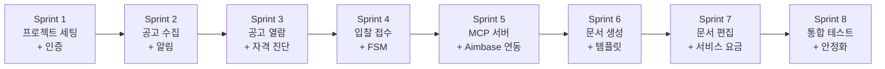

# SAM.gov Bidding Agency Platform Sprint 구조도

> 설계 버전: 1.0 | 최종 수정: 2026-03-19 | 관련 CR: -

> 단계: 1. Requirements | 설계

---

## Sprint 의존관계

> 화살표 방향 = 선행 Sprint 완료 후 진행. 풀스택 프로젝트이므로 각 Sprint에 BE/FE 작업을 함께 포함.

---

## Sprint 구조

### Sprint 1: 프로젝트 세팅 + 인증

| 기능 ID | 작업 내용 | 의존 관계 | 검증 기준 | 담당 | 상태 |
|---------|----------|----------|----------|------|------|
| 작업 1-1 | 프로젝트 구조 정리, docs 반영 | 없음 | CLAUDE.md 존재, docs/ 산출물 확인 | BE | |
| 작업 1-2 | DB 마이그레이션 정비 (역할 단순화 ADMIN/CUSTOMER) | 없음 | Flyway 마이그레이션 성공 | BE | |
| BID-AUTH-001 | 회원가입 API + 페이지 | 작업 1-2 | 회원가입 → DB 저장 → JWT 발급 | BE+FE | |
| BID-AUTH-002 | 로그인 API + 페이지 | BID-AUTH-001 | 로그인 → JWT 발급 → 인증 필요 API 호출 성공 | BE+FE | |
| BID-AUTH-003 | 토큰 갱신 | BID-AUTH-002 | Refresh Token으로 Access Token 재발급 성공 | BE | |

### Sprint 2: 공고 수집 + 알림

| 기능 ID | 작업 내용 | 의존 관계 | 검증 기준 | 담당 | 상태 |
|---------|----------|----------|----------|------|------|
| BID-OPP-001 | SAM.gov 스케줄 수집 | Sprint 1 | cron 실행 → 공고 DB 저장, 중복 검출 동작 | BE | |
| BID-OPP-003 | 첨부문서 자동 획득 | BID-OPP-001 | 수집 시 첨부파일 다운로드/링크 저장 확인 | BE | |
| BID-NOTIFY-001 | 이메일 발송 인프라 | Sprint 1 | 테스트 이메일 발송 성공, 발송 이력 DB 기록 | BE | |
| BID-OPP-004 | 수집 완료 이메일 알림 | BID-OPP-001, BID-NOTIFY-001 | 신규 공고 수집 시 관리자 이메일 수신 확인 | BE | |
| BID-OPP-002 | 수동 수집 트리거 | BID-OPP-001 | Admin API 호출 → 즉시 수집 실행 | BE | |

### Sprint 3: 공고 열람 + 자격 진단

| 기능 ID | 작업 내용 | 의존 관계 | 검증 기준 | 담당 | 상태 |
|---------|----------|----------|----------|------|------|
| BID-BROWSE-001 | 공고 목록 조회 (BE API + FE 페이지) | Sprint 2 | 페이징/검색/필터 동작, 결과 화면 표시 | BE+FE | |
| BID-BROWSE-002 | 공고 상세 조회 | BID-BROWSE-001 | 상세 정보 + 첨부파일 목록 표시 | BE+FE | |
| BID-BROWSE-003 | 필요 문서 목록 표시 | BID-BROWSE-002 | 카테고리별 분류, BLOCKER 표시, 체크리스트 형태 | FE | |
| BID-QUAL-001 | 입찰 자격 사전 진단 | BID-BROWSE-002 | 회사 프로필 기반 자격 진단 결과 표시 | BE+FE | |
| BID-QUAL-002 | 필수 인증/서류 가이드 | Sprint 1 | 가이드 페이지 정적 콘텐츠 표시 | FE | |

### Sprint 4: 입찰 접수 + FSM

| 기능 ID | 작업 내용 | 의존 관계 | 검증 기준 | 담당 | 상태 |
|---------|----------|----------|----------|------|------|
| BID-REQ-001 | 입찰 참여 신청 | Sprint 3 | 공고에서 신청 → BidRequest CREATED 상태 생성 | BE+FE | |
| BID-PRICE-002 | 서비스 단계별 선택 | Sprint 1 | 신청 시 서비스 레벨 선택 UI, 선택값 저장 | FE+BE | |
| BID-REQ-002 | 필요 문서 업로드 | BID-REQ-001 | 파일 업로드 → MinIO 저장 → 체크리스트 진행률 갱신 | BE+FE | |
| BID-FSM-001 | 상태 전이 실행 | BID-REQ-001 | 화이트리스트 검증, 전이 성공/거부, 이력 기록 | BE | |
| BID-REQ-003 | 내 입찰 목록 조회 | BID-REQ-001 | 고객 본인 입찰 목록 페이징 조회 | BE+FE | |
| BID-REQ-004 | 입찰 상세/이력 조회 | BID-FSM-001 | 상태 타임라인, 문서 목록 표시 | BE+FE | |
| BID-NOTIFY-002 | 마감일 임박 알림 | BID-NOTIFY-001 | D-7/D-3/D-1 이메일 발송, 중복 방지 확인 | BE | |

### Sprint 5: MCP 서버 + Aimbase 연동

| 기능 ID | 작업 내용 | 의존 관계 | 검증 기준 | 담당 | 상태 |
|---------|----------|----------|----------|------|------|
| BID-MCP-001 | MCP 서버 엔드포인트 | Sprint 4 | JSON-RPC 2.0 엔드포인트 응답, tool discovery 동작 | BE | |
| BID-MCP-002 | 공고 관련 Tool | BID-MCP-001 | 공고 조회/요구사항 조회 Tool 호출 성공 | BE | |
| BID-MCP-003 | 문서 관련 Tool | BID-MCP-001 | 문서 생성/조회/저장 Tool 호출 성공 | BE | |
| BID-MCP-004 | 입찰 상태 관련 Tool | BID-MCP-001 | 상태 조회/전이 Tool 호출 성공 | BE | |
| 작업 5-1 | Aimbase에 MCP 서버 등록 + Workflow 설계 | BID-MCP-001~004 | Aimbase에서 discover → Tool 목록 확인 | BE | |

### Sprint 6: 문서 생성 + 템플릿

| 기능 ID | 작업 내용 | 의존 관계 | 검증 기준 | 담당 | 상태 |
|---------|----------|----------|----------|------|------|
| BID-TPL-001 | 템플릿 등록 | Sprint 5 | Admin에서 템플릿 등록 → DB 저장 | BE+FE | |
| BID-TPL-002 | 템플릿 목록/상세 조회 | BID-TPL-001 | 목록 표시, 상세 내용 확인 | BE+FE | |
| BID-DOC-001 | AI 제안서 자동 작성 | Sprint 5, BID-TPL-001 | Aimbase Workflow 실행 → 문서 생성 → DB 저장 | BE | |
| BID-DOC-002 | 문서 생성 완료 이메일 알림 | BID-DOC-001, BID-NOTIFY-001 | 생성 완료 시 관리자 이메일 수신 | BE | |
| BID-DOC-003 | 문서 버전 관리 | BID-DOC-001 | 버전 목록 조회, 이전 버전 확인 | BE+FE | |

### Sprint 7: 문서 편집 + 서비스 요금

| 기능 ID | 작업 내용 | 의존 관계 | 검증 기준 | 담당 | 상태 |
|---------|----------|----------|----------|------|------|
| BID-EDIT-001 | 문서 후처리 편집 UI | Sprint 6 | TipTap 에디터 → 수정 → 새 버전 저장 | FE+BE | |
| BID-EDIT-002 | 문서 잠금/확정 | BID-EDIT-001 | DRAFT → LOCKED 전이, 편집 차단 확인 | BE+FE | |
| BID-EDIT-003 | PDF 내보내기 | BID-EDIT-001 | 문서 → PDF 생성 → 다운로드 | BE | |
| BID-PRICE-001 | 요금 안내 페이지 | Sprint 1 | 요금 정보 표시 (정적/관리자 설정) | FE | |
| BID-ADMIN-003 | 입찰 요청 관리 (Admin) | Sprint 4 | 전체 입찰 목록 조회, 상태 전이 실행 | FE | |

### Sprint 8: 통합 테스트 + 안정화

| 기능 ID | 작업 내용 | 의존 관계 | 검증 기준 | 담당 | 상태 |
|---------|----------|----------|----------|------|------|
| 작업 8-1 | E2E 플로우 테스트 | Sprint 7 | 공고 수집 → 입찰 신청 → AI 생성 → 편집 → 확정 전체 플로우 | BE+FE | |
| 작업 8-2 | 에러 핸들링 점검 | Sprint 7 | 각 실패 시나리오 (API 에러, AI 실패, 파일 업로드 실패) | BE+FE | |
| 작업 8-3 | 성능/보안 점검 | Sprint 7 | JWT 만료, 권한 검증, 파일 크기 제한 | BE | |
| 작업 8-4 | Docker Compose 배포 테스트 | Sprint 7 | 전체 서비스 docker-compose up → 정상 동작 | Infra | |

---

## Sprint 분리 원칙

1. 의존관계 순서로 배치 (인증 → 수집 → 열람 → 접수 → MCP → 문서 → 편집)
2. 1 Sprint = Claude Code 1세션. 세션 길어지면 컨텍스트 새므로 Sprint로 끊는다.
3. 각 Sprint에 검증 기준 필수. Claude Code가 테스트 코드로 변환한다.
4. Sprint 완료 시 CLAUDE.md에 진행 상태 기록 후 commit.
5. 풀스택: Sprint 내 BE API 먼저 → FE 연동 순서. BE/FE 병렬 시 Mock API 사용.
