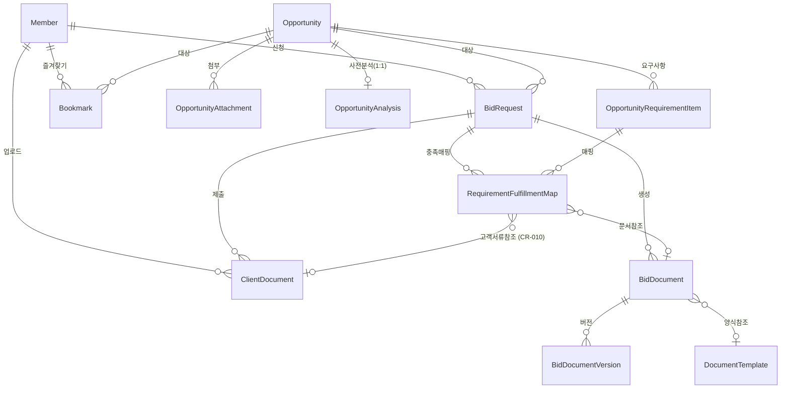

# SAM.gov Bidding Agency Platform 데이터 모델 정의

> 설계 버전: 1.1 | 최종 수정: 2026-03-28 | 관련 CR: CR-003

> 단계: 3. Detail Design | 실행스펙 섹션 2에 포함
>
> 엔티티, 필드, 관계, Enum, 인덱스를 정의한다.
> Claude Code가 이 문서를 보고 엔티티 코드와 마이그레이션을 생성한다.

---

## Enum 정의

### Role (회원 역할)

| 값 | 설명 |
|----|------|
| ADMIN | 관리자 (입찰 대행 운영) |
| CUSTOMER | 고객 (입찰 의뢰자) |

> 기존 6개 역할(ADMIN, ANALYST, WRITER, REVIEWER, SUBMITTER, MEMBER)에서 2개로 단순화

### BidRequestState (입찰 요청 상태)

| 값 | 설명 |
|----|------|
| CREATED | 신청 접수 |
| DOCS_PENDING | 문서 대기 (고객에게 안내 전달) |
| DOCS_RECEIVED | 문서 접수 완료 |
| ANALYZING | AI 요구사항 분석 중 |
| GENERATING | AI 문서 생성 중 |
| REVIEW | 관리자 검토 |
| CONFIRMED | 확정 (문서 잠금) |
| SUBMITTED | 제출 완료 (최종) |
| CLOSED | 종료 (최종) |

> FSM 전이 규칙은 T1-5 참조

### DocumentType (문서 유형)

| 값 | 설명 |
|----|------|
| COVER_LETTER | 커버레터 |
| TECHNICAL_PROPOSAL | 기술 제안서 |
| PAST_PERFORMANCE | 과거 수행 실적 |
| COMPANY_PROFILE | 회사 프로필 |
| COMPLIANCE_MATRIX | 컴플라이언스 매트릭스 |
| PRICING_SUMMARY | 가격 요약 |
| OTHER | 기타 |

### DocumentStatus (문서 상태)

| 값 | 설명 |
|----|------|
| DRAFT | 초안 (편집 가능) |
| LOCKED | 잠금 (편집 불가) |
| ARCHIVED | 보관 (제출 후) |

> FSM 전이: DRAFT → LOCKED → ARCHIVED, LOCKED → DRAFT (잠금 해제)

### RequirementCategory (요구사항 카테고리)

| 값 | 설명 |
|----|------|
| DOCUMENT | 문서 |
| FORMAT | 형식 |
| SUBMISSION | 제출 |
| DEADLINE | 마감 |
| ELIGIBILITY | 자격 |
| TECHNICAL | 기술 |
| OTHER | 기타 |

### FulfillmentType (충족 유형)

| 값 | 설명 |
|----|------|
| DOCUMENT_SECTION | 문서 섹션으로 충족 |
| ATTACHMENT | 첨부파일로 충족 |
| NOT_APPLICABLE | 해당 없음 |
| MISSING | 미충족 |

### FulfillmentStatus (충족 상태)

| 값 | 설명 |
|----|------|
| PENDING | 대기 |
| FULFILLED | 충족 |
| MISSING | 미충족 |

### ServiceLevel (서비스 레벨)

| 값 | 설명 |
|----|------|
| MONITORING | 모니터링만 (공고 추적) |
| ANALYSIS | 분석 + 정리 (요구사항 분석) |
| AI_PROPOSAL | AI 제안서 작성 포함 |
| FULL_PACKAGE | 풀패키지 (제출 대행까지) |

### NotificationType (알림 유형)

| 값 | 설명 |
|----|------|
| COLLECTION_COMPLETE | 수집 완료 알림 |
| DOCUMENT_GENERATED | 문서 생성 완료 알림 |
| DEADLINE_D7 | 마감 7일 전 알림 |
| DEADLINE_D3 | 마감 3일 전 알림 |
| DEADLINE_D1 | 마감 1일 전 알림 |
| BID_REQUEST_CREATED | 입찰 신청 접수 알림 |
| AI_WORKFLOW_FAILED | AI 워크플로우 실패 알림 |

### OpportunityVisibility (공고 노출 상태) — CR-003 신규

| 값 | 설명 |
|----|------|
| HIDDEN | 비노출 (수집 직후 기본값, 관리자 승인 전) |
| VISIBLE | 노출 (관리자 승인 후 사용자에게 노출) |

### AnalysisStatus (사전 분석 상태) — CR-003 신규

| 값 | 설명 |
|----|------|
| PENDING | 분석 대기 |
| ANALYZING | LLM 분석 중 |
| COMPLETED | 분석 완료 |
| FAILED | 분석 실패 |

### AttachmentDownloadStatus (첨부 다운로드 상태)

| 값 | 설명 |
|----|------|
| SUCCESS | 다운로드 성공 |
| FAILED | 다운로드 실패 |
| LINK_ONLY | 링크만 저장 (직접 다운 불가) |

---

## 엔티티 정의

### Member (회원)

| 필드 | 타입 | 필수 | 기본값 | 설명 |
|------|------|------|--------|------|
| id | BINARY(16) | PK | auto | UUID |
| email | VARCHAR(255) | Y | | UNIQUE |
| password_hash | VARCHAR(255) | Y | | bcrypt |
| company_name | VARCHAR(255) | Y | | 회사명 |
| business_registration_number | VARCHAR(50) | N | | 사업자등록번호 |
| contact_person | VARCHAR(100) | N | | 담당자명 |
| phone | VARCHAR(50) | N | | 연락처 |
| address | TEXT | N | | 주소 |
| role | Role | Y | CUSTOMER | ADMIN / CUSTOMER |
| last_login_at | DATETIME(6) | N | | 최종 로그인 |
| created_at | DATETIME(6) | Y | now() | |
| updated_at | DATETIME(6) | Y | now() | |

**인덱스**:
- `uniq_members_email` — email (UNIQUE)

---

### Opportunity (공고)

| 필드 | 타입 | 필수 | 기본값 | 설명 |
|------|------|------|--------|------|
| id | BINARY(16) | PK | auto | UUID |
| notice_id | VARCHAR(255) | Y | | UNIQUE. SAM.gov 공고 ID |
| solicitation_number | VARCHAR(255) | N | | 입찰번호 |
| title | VARCHAR(500) | Y | | 공고 제목 |
| type | VARCHAR(100) | N | | 공고 유형 |
| organization_name | VARCHAR(255) | N | | 발주 기관명 |
| posted_date | DATETIME(6) | N | | 게시일 |
| response_deadline | DATETIME(6) | N | | 마감일 |
| active | BOOLEAN | Y | true | 활성 여부 |
| visibility | OpportunityVisibility | Y | HIDDEN | 노출 상태 (CR-003). HIDDEN=비노출, VISIBLE=사용자 노출 |
| ui_link | TEXT | N | | SAM.gov 상세 링크 |
| description_link | TEXT | N | | 설명 페이지 링크 |
| content_hash | VARCHAR(64) | N | | 중복 검출용 해시 |
| first_seen_at | DATETIME(6) | Y | | 최초 수집일 |
| last_modified_at | DATETIME(6) | Y | | 최종 갱신일 |
| raw_json | JSON | N | | SAM.gov 원본 JSON (BIZ-004) |
| created_at | DATETIME(6) | Y | now() | |
| updated_at | DATETIME(6) | Y | now() | |

**인덱스**:
- `uniq_opportunities_notice_id` — notice_id (UNIQUE)
- `idx_opportunities_posted_date` — posted_date
- `idx_opportunities_deadline` — response_deadline
- `idx_opportunities_active` — active
- `idx_opportunities_visibility` — visibility (CR-003)

---

### OpportunityAttachment (공고 첨부문서) — **신규**

| 필드 | 타입 | 필수 | 기본값 | 설명 |
|------|------|------|--------|------|
| id | BINARY(16) | PK | auto | UUID |
| opportunity_id | BINARY(16) | FK | | → Opportunity.id |
| file_name | VARCHAR(500) | Y | | 원본 파일명 |
| file_size | BIGINT | N | | 파일 크기 (bytes) |
| content_type | VARCHAR(100) | N | | MIME type |
| source_url | TEXT | Y | | 원본 다운로드 URL |
| storage_url | TEXT | N | | MinIO 저장 경로 |
| download_status | AttachmentDownloadStatus | Y | FAILED | SUCCESS/FAILED/LINK_ONLY |
| downloaded_at | DATETIME(6) | N | | 다운로드 완료 시점 |
| created_at | DATETIME(6) | Y | now() | |
| updated_at | DATETIME(6) | Y | now() | |

**인덱스**:
- `idx_opp_attachments_opportunity` — opportunity_id
- `idx_opp_attachments_status` — download_status

---

### OpportunityAnalysis (공고 사전 분석) — **CR-003 신규**

| 필드 | 타입 | 필수 | 기본값 | 설명 |
|------|------|------|--------|------|
| id | BINARY(16) | PK | auto | UUID |
| opportunity_id | BINARY(16) | FK | | → Opportunity.id (UNIQUE — 공고당 1건) |
| status | AnalysisStatus | Y | PENDING | 분석 상태 |
| summary_json | JSON | N | | 공고 요약본 (구조화된 요약) |
| document_formats_json | JSON | N | | 문서 양식 정보 (어떤 문서를 어떤 구조로 작성해야 하는지) |
| required_documents_json | JSON | N | | 필요 서류 목록 (사용자가 준비해야 할 서류) |
| llm_prompt_preset_json | JSON | N | | LLM 프롬프트 프리셋 (문서 작성 시 LLM에 전달할 컨텍스트) |
| analyzed_at | DATETIME(6) | N | | 분석 완료 시점 |
| error_message | TEXT | N | | 분석 실패 시 에러 메시지 |
| workflow_run_id | VARCHAR(255) | N | | Aimbase 워크플로우 실행 ID |
| created_at | DATETIME(6) | Y | now() | |
| updated_at | DATETIME(6) | Y | now() | |

**인덱스**:
- `uniq_opp_analysis_opportunity` — opportunity_id (UNIQUE)
- `idx_opp_analysis_status` — status

**설계 원칙**:
- 공고당 1건만 존재 (1:1 관계). 재분석 시 기존 레코드를 UPDATE
- 분석 결과 4개 JSON 필드는 각각 독립적. Aimbase MCP 콜백으로 개별 저장 가능
- `llm_prompt_preset_json`은 사용자에게 직접 노출되지 않음. 문서 작성 시 LLM 입력으로만 사용

---

### OpportunityRequirementItem (공고 요구사항)

| 필드 | 타입 | 필수 | 기본값 | 설명 |
|------|------|------|--------|------|
| id | BINARY(16) | PK | auto | UUID |
| opportunity_id | BINARY(16) | FK | | → Opportunity.id |
| category | RequirementCategory | Y | | 카테고리 |
| title | VARCHAR(500) | Y | | 요구사항 제목 |
| description | TEXT | N | | 상세 설명 |
| requirement_json | JSON | Y | | 구조화된 요구사항 데이터 |
| is_blocker | BOOLEAN | Y | false | BLOCKER 여부 (BIZ-007) |
| is_verified | BOOLEAN | Y | false | 검증 완료 여부 |
| created_at | DATETIME(6) | Y | now() | |
| updated_at | DATETIME(6) | Y | now() | |

**인덱스**:
- `idx_requirement_items_opportunity` — opportunity_id
- `idx_requirement_items_category` — category
- `idx_requirement_items_blocker` — is_blocker

---

### BidRequest (입찰 요청)

| 필드 | 타입 | 필수 | 기본값 | 설명 |
|------|------|------|--------|------|
| id | BINARY(16) | PK | auto | UUID |
| member_id | BINARY(16) | FK | | → Member.id (신청 고객) |
| opportunity_id | BINARY(16) | FK | | → Opportunity.id |
| state | BidRequestState | Y | CREATED | 현재 상태 |
| service_level | ServiceLevel | Y | | 선택한 서비스 레벨 |
| state_history | JSON | Y | [] | 상태 전이 이력 |
| assigned_to | BINARY(16) | N | | → Member.id (담당 관리자) |
| submitted_at | DATETIME(6) | N | | 제출 완료 시점 |
| closed_at | DATETIME(6) | N | | 종료 시점 |
| close_reason | VARCHAR(500) | N | | 종료 사유 |
| created_at | DATETIME(6) | Y | now() | |
| updated_at | DATETIME(6) | Y | now() | |

**state_history JSON 구조**:
```json
[
  {
    "fromState": "CREATED",
    "toState": "DOCS_PENDING",
    "userId": "uuid",
    "username": "admin@example.com",
    "timestamp": "2026-03-19T10:00:00",
    "notes": "필요 문서 안내 완료",
    "automatic": false
  }
]
```

**인덱스**:
- `idx_bid_requests_state` — state
- `idx_bid_requests_member` — member_id
- `idx_bid_requests_opportunity` — opportunity_id
- `uniq_bid_requests_member_opportunity` — (member_id, opportunity_id) UNIQUE — BIZ-006

---

### ClientDocument (고객 제출 문서) — **신규 엔티티화**

| 필드 | 타입 | 필수 | 기본값 | 설명 |
|------|------|------|--------|------|
| id | BINARY(16) | PK | auto | UUID |
| bid_request_id | BINARY(16) | FK | | → BidRequest.id |
| member_id | BINARY(16) | FK | | → Member.id (업로더) |
| file_name | VARCHAR(500) | Y | | 원본 파일명 |
| file_size | BIGINT | Y | | 파일 크기 (bytes, ≤ 50MB BIZ-011) |
| content_type | VARCHAR(100) | Y | | MIME type |
| storage_url | TEXT | Y | | MinIO 저장 경로 |
| document_category | VARCHAR(100) | N | | 문서 분류 (사업자등록증, 경력증명 등) |
| created_at | DATETIME(6) | Y | now() | |
| updated_at | DATETIME(6) | Y | now() | |

**인덱스**:
- `idx_client_documents_bid_request` — bid_request_id
- `idx_client_documents_member` — member_id

---

### BidDocument (입찰 문서)

| 필드 | 타입 | 필수 | 기본값 | 설명 |
|------|------|------|--------|------|
| id | BINARY(16) | PK | auto | UUID |
| bid_request_id | BINARY(16) | FK | | → BidRequest.id |
| document_type | DocumentType | Y | | 문서 유형 |
| status | DocumentStatus | Y | DRAFT | DRAFT/LOCKED/ARCHIVED |
| current_version_no | INTEGER | Y | 1 | 현재 버전 번호 |
| template_id | BINARY(16) | N | | → DocumentTemplate.id (사용된 템플릿) |
| created_at | DATETIME(6) | Y | now() | |
| updated_at | DATETIME(6) | Y | now() | |

**인덱스**:
- `idx_bid_documents_bid_request` — bid_request_id
- `idx_bid_documents_type` — document_type
- `idx_bid_documents_status` — status

---

### BidDocumentVersion (문서 버전)

| 필드 | 타입 | 필수 | 기본값 | 설명 |
|------|------|------|--------|------|
| id | BINARY(16) | PK | auto | UUID |
| document_id | BINARY(16) | FK | | → BidDocument.id |
| version_no | INTEGER | Y | | 버전 번호 |
| content_json | JSON | Y | | TipTap 에디터 JSON (BIZ-002 불변) |
| edited_by | BINARY(16) | Y | | → Member.id (편집자) |
| edited_at | DATETIME(6) | Y | | 편집 시점 |
| change_summary | TEXT | N | | 변경 요약 |
| word_count | INTEGER | N | | 단어 수 |
| created_at | DATETIME(6) | Y | now() | |
| updated_at | DATETIME(6) | Y | now() | |

**인덱스**:
- `idx_bid_doc_versions_document` — document_id
- `uniq_document_version` — (document_id, version_no) UNIQUE

---

### DocumentTemplate (문서 양식)

| 필드 | 타입 | 필수 | 기본값 | 설명 |
|------|------|------|--------|------|
| id | BINARY(16) | PK | auto | UUID |
| template_name | VARCHAR(255) | Y | | 양식 이름 |
| document_type | DocumentType | Y | | 문서 유형 |
| template_version | INTEGER | Y | 1 | 양식 버전 |
| content_json | JSON | Y | | TipTap 형식 양식 내용 |
| description | TEXT | N | | 양식 설명 |
| active | BOOLEAN | Y | true | 활성 여부 (BIZ-010) |
| created_at | DATETIME(6) | Y | now() | |
| updated_at | DATETIME(6) | Y | now() | |

**인덱스**:
- `idx_templates_type` — document_type
- `idx_templates_active` — active

---

### RequirementFulfillmentMap (요구사항 충족 매핑)

| 필드 | 타입 | 필수 | 기본값 | 설명 |
|------|------|------|--------|------|
| id | BINARY(16) | PK | auto | UUID |
| bid_request_id | BINARY(16) | FK | | → BidRequest.id |
| requirement_item_id | BINARY(16) | FK | | → OpportunityRequirementItem.id |
| fulfillment_type | FulfillmentType | Y | | 충족 유형 (CR-010: `CLIENT_DOCUMENT` 값 추가) |
| document_id | BINARY(16) | N | | → BidDocument.id (AI 생성 문서로 충족 시) |
| client_document_id | BINARY(16) | N | | → ClientDocument.id (CR-010, 고객 업로드 서류로 충족 시) |
| document_section_path | TEXT | N | | 문서 내 섹션 경로 |
| attachment_reference | TEXT | N | | 첨부파일 참조 |
| status | FulfillmentStatus | Y | PENDING | 충족 상태 |
| notes | TEXT | N | | 비고 |
| mapped_by | BINARY(16) | N | | → Member.id |
| mapped_at | DATETIME(6) | N | | |
| created_at | DATETIME(6) | Y | now() | |
| updated_at | DATETIME(6) | Y | now() | |

**인덱스**:
- `idx_fulfillment_bid_request` — bid_request_id
- `idx_fulfillment_requirement` — requirement_item_id
- `idx_fulfillment_status` — status
- `idx_fulfillment_client_document` — client_document_id (CR-010)

**FulfillmentType enum** (CR-010 갱신):
- `DOCUMENT_SECTION` — AI 생성 문서의 특정 섹션으로 충족 (기존)
- `ATTACHMENT` — 첨부파일 참조로 충족 (기존)
- `CLIENT_DOCUMENT` — 고객 업로드 ClientDocument로 충족 (CR-010 신규)
- `MANUAL` — 관리자 수동 확인 (기존)
- `MISSING` — 미충족 (기존)

**UNIQUE 제약 (CR-010)**: `(bid_request_id, requirement_item_id)` — 한 의뢰의 한 요구사항은 한 슬롯

---

### Bookmark (즐겨찾기)

| 필드 | 타입 | 필수 | 기본값 | 설명 |
|------|------|------|--------|------|
| id | BINARY(16) | PK | auto | UUID |
| member_id | BINARY(16) | FK | | → Member.id |
| opportunity_id | BINARY(16) | FK | | → Opportunity.id |
| created_at | DATETIME(6) | Y | now() | |
| updated_at | DATETIME(6) | Y | now() | |

**인덱스**:
- `uniq_bookmark` — (member_id, opportunity_id) UNIQUE
- `idx_bookmarks_member` — member_id

---

### NotificationLog (알림 이력) — **신규**

| 필드 | 타입 | 필수 | 기본값 | 설명 |
|------|------|------|--------|------|
| id | BINARY(16) | PK | auto | UUID |
| notification_type | NotificationType | Y | | 알림 유형 |
| recipient_email | VARCHAR(255) | Y | | 수신자 이메일 |
| recipient_id | BINARY(16) | N | | → Member.id |
| subject | VARCHAR(500) | Y | | 이메일 제목 |
| reference_id | BINARY(16) | N | | 참조 엔티티 ID (공고/입찰 등) |
| reference_type | VARCHAR(50) | N | | 참조 엔티티 타입 |
| sent_at | DATETIME(6) | Y | | 발송 시점 |
| success | BOOLEAN | Y | | 발송 성공 여부 |
| error_message | TEXT | N | | 실패 시 에러 메시지 |
| idempotency_key | VARCHAR(255) | Y | | 멱등 키 (BIZ-012) |
| created_at | DATETIME(6) | Y | now() | |

**인덱스**:
- `uniq_notification_idempotency` — idempotency_key (UNIQUE)
- `idx_notification_type` — notification_type
- `idx_notification_reference` — (reference_type, reference_id)
- `idx_notification_sent_at` — sent_at

---

### CollectorRun (수집 실행 이력)

| 필드 | 타입 | 필수 | 기본값 | 설명 |
|------|------|------|--------|------|
| id | BINARY(16) | PK | auto | UUID |
| keyword | VARCHAR(255) | N | | 검색 키워드 |
| started_at | DATETIME(6) | Y | | 수집 시작 |
| completed_at | DATETIME(6) | N | | 수집 완료 |
| total_fetched | INTEGER | Y | 0 | 조회된 공고 수 |
| new_count | INTEGER | Y | 0 | 신규 공고 수 |
| updated_count | INTEGER | Y | 0 | 갱신 공고 수 |
| success | BOOLEAN | Y | | 성공 여부 |
| error_message | TEXT | N | | 실패 시 에러 |
| triggered_by | VARCHAR(50) | Y | | SCHEDULED / MANUAL |
| created_at | DATETIME(6) | Y | now() | |

**인덱스**:
- `idx_collector_runs_started_at` — started_at
- `idx_collector_runs_success` — success

---

### KeywordGroup (수집 키워드)

| 필드 | 타입 | 필수 | 기본값 | 설명 |
|------|------|------|--------|------|
| id | BINARY(16) | PK | auto | UUID |
| keyword | VARCHAR(255) | Y | | 검색 키워드 |
| active | BOOLEAN | Y | true | 활성 여부 |
| created_at | DATETIME(6) | Y | now() | |
| updated_at | DATETIME(6) | Y | now() | |

**인덱스**:
- `idx_keyword_groups_active` — active

---

### EventLog (이벤트 로그)

| 필드 | 타입 | 필수 | 기본값 | 설명 |
|------|------|------|--------|------|
| id | BINARY(16) | PK | auto | UUID |
| event_type | VARCHAR(100) | Y | | 이벤트 유형명 |
| entity_type | VARCHAR(50) | Y | | 대상 엔티티 타입 |
| entity_id | BINARY(16) | Y | | 대상 엔티티 ID |
| actor_id | BINARY(16) | N | | → Member.id (행위자) |
| payload | JSON | N | | 이벤트 데이터 |
| created_at | DATETIME(6) | Y | now() | |

**인덱스**:
- `idx_event_logs_type` — event_type
- `idx_event_logs_entity` — (entity_type, entity_id)
- `idx_event_logs_created_at` — created_at

---

## 엔티티 관계



---

## 변경 사항 요약 (기존 대비)

| 변경 | 내용 | 사유 |
|------|------|------|
| Role 단순화 | 6개 → 2개 (ADMIN, CUSTOMER) | 관리자 중심 운영 모델 |
| 구독 필드 제거 | subscription_status 등 제거 | MVP 범위 외 |
| BidRequestState 단순화 | 12개 → 9개 | 워크플로우 간소화 |
| DocumentStatus 변경 | DRAFT/READY/APPROVED/LOCKED → DRAFT/LOCKED/ARCHIVED | T1-5 FSM 기준 |
| service_level 추가 | BidRequest에 ServiceLevel 필드 | 서비스 레벨별 과금 |
| OpportunityAttachment 신규 | 공고 첨부문서 관리 | BID-OPP-003 |
| ClientDocument 엔티티화 | 기존 테이블 → 엔티티 클래스 | BID-REQ-002 |
| NotificationLog 신규 | 이메일 알림 이력 | BID-NOTIFY-001, BIZ-012 |
| template_id 추가 | BidDocument에 사용 템플릿 참조 | BID-TPL-001 |
| OpportunityAnalysis 신규 (CR-003) | 공고 사전 분석 결과 저장 (요약, 양식, 필요서류, 프롬프트 프리셋) | BID-OPP-006 |
| Opportunity.visibility 추가 (CR-003) | 공고 노출 상태 (HIDDEN/VISIBLE) | BID-OPP-008 |
