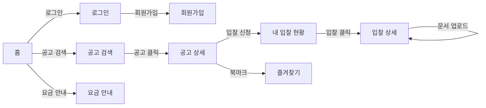
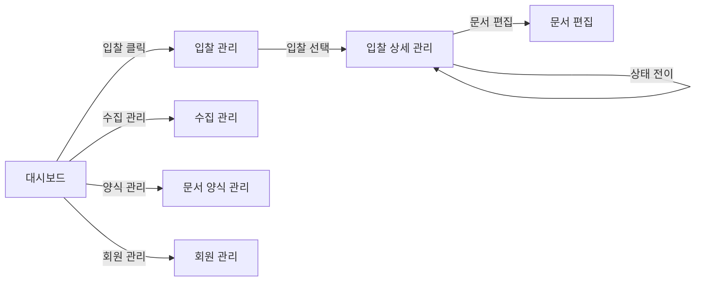

# SAM.gov Bidding Agency Platform 화면 구조 (IA)

> 설계 버전: 1.0 | 최종 수정: 2026-03-19 | 관련 CR: -

> 단계: 3. Detail Design | 실행스펙 섹션 8에 포함
>
> 화면의 **정보 구조(Information Architecture)**를 정의한다.
> 어떤 페이지가 있고, 각 페이지가 무엇을 보여주며, 어떻게 연결되는가.

---

## Customer Portal 페이지 목록

| 경로 | 페이지명 | 인증 | 역할 | 설명 | Sprint |
|------|---------|------|------|------|--------|
| `/` | 홈 | | | 서비스 소개, 최근 공고, CTA | 1 |
| `/login` | 로그인 | | | 이메일/비밀번호 로그인 | 1 |
| `/register` | 회원가입 | | | 회원가입 폼 | 1 |
| `/search` | 공고 검색 | | | 공고 목록 + 필터/검색 | 3 |
| `/search/{id}` | 공고 상세 | | | 공고 내용 + 요구사항 + 첨부 | 3 |
| `/pricing` | 요금 안내 | | | 서비스 레벨별 요금 | 7 |
| `/guide` | 인증/서류 가이드 | | | USFK 입찰 필수 인증 안내 | 3 |
| `/proposals` | 내 입찰 현황 | 🔒 | | 입찰 목록 + 상태 추적 | 4 |
| `/proposals/{id}` | 입찰 상세 | 🔒 | | 상태 타임라인 + 문서 뷰어 | 4 |
| `/bookmarks` | 즐겨찾기 | 🔒 | | 북마크한 공고 목록 | 3 |
| `/profile` | 내 프로필 | 🔒 | | 회사 정보 수정 | 1 |

---

## Admin Console 페이지 목록

| 경로 | 페이지명 | 인증 | 역할 | 설명 | Sprint |
|------|---------|------|------|------|--------|
| `/login` | 관리자 로그인 | | Admin | 관리자 인증 | 1 |
| `/` | 대시보드 | 🔒 | Admin | 입찰 통계, 최근 현황 | 4 |
| `/bid-requests` | 입찰 관리 | 🔒 | Admin | 전체 입찰 목록 + 상태 전이 | 4 |
| `/bid-requests/{id}` | 입찰 상세 관리 | 🔒 | Admin | 상태 변경, 문서 확인, 담당자 배정 | 4 |
| `/bid-requests/{id}/documents/{docId}` | 문서 편집 | 🔒 | Admin | TipTap 에디터 + 버전 관리 | 7 |
| `/collection` | 수집 관리 | 🔒 | Admin | SAM.gov 수집 현황 + 수동 트리거 | 2 |
| `/templates` | 문서 양식 관리 | 🔒 | Admin | 템플릿 CRUD | 6 |
| `/members` | 회원 관리 | 🔒 | Admin | 고객 목록 관리 | 1 |
| `/rfp-samples` | 성공 제안서 패턴 | 🔒 | Admin | 성공 제안서 등록 목록 + 공고유형별 가이드 상태/편집 (CR-013-R) | CR-013 |
| `/rfp-samples/{id}` | 성공 제안서 상세 | 🔒 | Admin | 메타 + 원본 파일 업로드/목록 (슬롯 배치 폐기, CR-013-R) | CR-013 |

---

## Customer Portal 페이지별 주요 영역

### 홈 (`/`)

**목적:** 서비스를 소개하고 공고 검색으로 유도한다.

| 영역 | 표시/입력 데이터 | 주요 액션 |
|------|-----------------|----------|
| 히어로 | 서비스 한줄 소개, 검색 입력 | 공고 검색 페이지 이동 |
| 서비스 특징 | AI 제안서, 전문 대행, 자격 진단 설명 | — |
| 진행 절차 | 4단계 (검색 → 신청 → AI 작성 → 제출) | — |
| 최근 공고 | 최근 등록 공고 카드 목록 | 공고 상세로 이동 |
| CTA | 시작하기 버튼 | 회원가입/검색으로 이동 |

### 공고 검색 (`/search`)

**목적:** SAM.gov 입찰 공고를 검색하고 관심 공고를 찾는다.

| 영역 | 표시/입력 데이터 | 주요 액션 |
|------|-----------------|----------|
| 검색바 | 키워드 입력 | 검색 실행 |
| 필터 | 공고 유형, 기관명, 마감일 범위 | 필터 적용 |
| 통계 카드 | 전체 공고 수, 마감 임박 수 | — |
| 공고 목록 | 제목, 기관명, 게시일, 마감일, 상태 | 상세로 이동, 북마크 토글 |
| 페이지네이션 | 현재 페이지, 전체 페이지 | 페이지 이동 |

### 공고 상세 (`/search/{id}`)

**목적:** 공고 내용을 확인하고 입찰 참여를 결정한다.

| 영역 | 표시/입력 데이터 | 주요 액션 |
|------|-----------------|----------|
| 공고 헤더 | 제목, 기관명, 게시일, 마감일, D-day | 북마크 토글 |
| AI 분석 배지 | "AI 분석 완료" + 분석 일시 (COMPLETED 시만 표시) | — |
| 공고 요약 (AI) | 핵심 요약, 작업 범위, 참여 자격, 평가 기준, 예산 정보, 특이사항 | — |
| 주요 일정 (AI) | 주요 일정 테이블 (항목, 일자, 비고) | — |
| 필요 서류 체크리스트 (AI) | 서류명, 필수/선택 배지, 제출 형식, 페이지 제한 | 체크리스트 확인 |
| 문서 양식 안내 (AI) | 전반 안내, 섹션별 양식 카드, 제출 방법 | — |
| 첨부문서 | 파일명, 다운로드 링크 | 파일 다운로드 |
| SAM.gov 원본 | 접이식 — 원본 description + 원문 링크 | 외부 링크 열기 |
| 입찰 신청 | 서비스 레벨 선택 | 입찰 참여 신청 |
| 자격 진단 | AI 진단 결과 (요청 시) | 자격 진단 요청 |

> **분석 미완료 fallback**: AI 분석 섹션 미표시, 기존 원본(description + resourceLinks) 그대로 표시

### 내 입찰 현황 (`/proposals`)

**목적:** 내가 신청한 입찰 건의 진행 상태를 추적한다.

| 영역 | 표시/입력 데이터 | 주요 액션 |
|------|-----------------|----------|
| 상태 필터 | 전체/진행중/완료 | 필터 적용 |
| 입찰 목록 | 공고 제목, 상태, 서비스 레벨, 신청일 | 상세로 이동 |
| 빈 상태 | 신청 건 없을 때 안내 | 공고 검색으로 이동 |

### 입찰 상세 (`/proposals/{id}`)

**목적:** 입찰 진행 상태와 문서를 확인한다.

| 영역 | 표시/입력 데이터 | 주요 액션 |
|------|-----------------|----------|
| 상태 타임라인 | 현재 상태, 상태 변화 이력, 각 단계 시각 | — |
| 공고 정보 | 제목, 기관명, 마감일 | 공고 상세로 이동 |
| 제출 서류 (CR-010 슬롯화) | 공고가 요구하는 BLOCKER 슬롯 목록(요구사항 제목/설명/카테고리/충족 상태). 각 슬롯에 업로드된 ClientDocument 요약(파일명/크기/업로드일) 또는 미충족 표시. 상단 진행률(`fulfilledBlocker / totalBlocker`) | 슬롯별 파일 선택/업로드(`POST /required-document-slots/{requirementItemId}/upload`), 매핑 해제(`DELETE`) |
| 생성 문서 | AI 생성 제안서 목록, 상태(DRAFT/LOCKED) | 문서 미리보기 |
| 액션 | "문서 제출 완료" 버튼 — 모든 BLOCKER 슬롯 충족(`canTransitionToDocsReceived=true`)일 때만 활성화 (BIZ-015) | 취소 (DOCS_PENDING 이전), DOCS_RECEIVED 전이 요청 |

### 요금 안내 (`/pricing`)

**목적:** 서비스 레벨별 비용을 확인한다.

| 영역 | 표시/입력 데이터 | 주요 액션 |
|------|-----------------|----------|
| 요금 카드 | 레벨명, 포함 서비스, 가격 | — |
| 비교 표 | 레벨별 기능 비교 | — |
| 문의 | 연락처/문의 폼 | 문의하기 |

---

## Admin Console 페이지별 주요 영역

### 대시보드 (`/`)

**목적:** 전체 입찰 현황을 한눈에 파악한다.

| 영역 | 표시/입력 데이터 | 주요 액션 |
|------|-----------------|----------|
| 통계 카드 | 상태별 입찰 수 (CREATED, REVIEW, SUBMITTED 등) | — |
| 최근 입찰 | 최근 입찰 목록 (5~10건) | 입찰 상세로 이동 |
| 마감 임박 | D-7 이내 입찰 건 | 입찰 상세로 이동 |

### 입찰 관리 (`/bid-requests`)

**목적:** 전체 입찰 건을 관리하고 상태를 전이한다.

| 영역 | 표시/입력 데이터 | 주요 액션 |
|------|-----------------|----------|
| 상태 필터 | BidRequestState 필터 탭 | 필터 적용 |
| 입찰 테이블 | 고객명, 공고 제목, 상태, 서비스 레벨, 마감일 | 상세로 이동 |
| 페이지네이션 | 현재 페이지, 전체 페이지 | 페이지 이동 |

### 입찰 상세 관리 (`/bid-requests/{id}`)

**목적:** 입찰 건의 상태를 변경하고 문서를 관리한다.

| 영역 | 표시/입력 데이터 | 주요 액션 |
|------|-----------------|----------|
| 상태 패널 | 현재 상태, 허용 다음 상태 | 상태 전이 실행 (노트 입력) |
| 고객 정보 | 회사명, 연락처 | — |
| 공고 정보 | 제목, 마감일, 요구사항 수 | 공고 상세로 이동 |
| 제출 문서 | 고객 제출 문서 목록 | 다운로드 |
| 생성 문서 | AI 생성 문서 목록, 상태 | 문서 편집으로 이동 |
| 상태 이력 | 전이 이력 타임라인 | — |

### 문서 편집 (`/bid-requests/{id}/documents/{docId}`)

**목적:** AI 생성 문서를 검토/수정하고 확정한다.

| 영역 | 표시/입력 데이터 | 주요 액션 |
|------|-----------------|----------|
| 에디터 | TipTap 리치 텍스트 에디터, 문서 내용 | 내용 편집, 저장 |
| 버전 사이드바 | 버전 목록, 각 버전 메타데이터 | 이전 버전 조회 |
| 툴바 | 서식 도구 | 볼드, 제목, 목록 등 |
| 액션 바 | — | 저장, 잠금(확정), 잠금 해제, PDF 내보내기 |

### 수집 관리 (`/collection`)

**목적:** SAM.gov 수집 상태를 확인하고 수동 수집을 실행한다.

| 영역 | 표시/입력 데이터 | 주요 액션 |
|------|-----------------|----------|
| 수집 상태 | 마지막 수집 시간, 결과 | — |
| 수동 수집 | 조회 기간(daysBack) 입력 | 수집 트리거 실행 |
| 수집 이력 | 실행 이력 목록 | — |

### 공고문 관리 상세 (`/notices/{id}`) — CR-016 / CR-039

**목적:** 원본에서 한글화된 공고문을 검수하고, 한글화 결과를 확인/재생성/보정하며 고객 노출을 토글한다. 구현체: [NoticeAdminDetailPage.tsx](../frontend/admin-console/src/pages/NoticeAdminDetailPage.tsx).

| 영역 | 표시/입력 데이터 | 주요 액션 |
|------|-----------------|----------|
| 헤더 | 영문 제목, 한글 제목, solNo, 한글화 상태(PENDING/ANALYZING/COMPLETED/FAILED), 노출 상태 | **재생성**(COMPLETED/FAILED일 때, ANALYZING 중 disabled) · **노출 승인/해제** · **강제 중단(CR-039)** · **삭제(CR-040)** |
| 한글화 결과 | ANALYZING이면 "LLM이 공고를 한글화/요약하고 있습니다…" 스피너, COMPLETED면 contentJson 렌더, FAILED면 errorMessage | — |

> **CR-039 강제 중단**: generationStatus가 `ANALYZING`일 때만 "강제 중단" 버튼을 노출한다. 클릭 시 `POST /admin/notices/{id}/cancel` → FAILED 전환 → 재생성 버튼 disabled(=ANALYZING 조건) 해제로 재시도 가능. 무한 폴링(스피너만 도는 stuck) 탈출용. 자동 정리(스케줄러)는 화면 액션 없이 백그라운드로 동일 처리.
> **CR-040 삭제**: "삭제" 버튼은 VISIBLE(노출 중)·ANALYZING(분석 중)이 아닐 때만 활성. 클릭 시 확인 모달 → `DELETE /admin/notices/{id}` → 성공 시 목록(`/notices`)으로 이동. 서버가 가드 위반 시 409 + 사유 메시지(노출 중/분석 중) 노출. hard delete라 복구 불가 — 모달에 경고.

### 문서 양식 관리 (`/templates`)

**목적:** 제안서 작성에 사용할 문서 양식을 등록/관리한다.

| 영역 | 표시/입력 데이터 | 주요 액션 |
|------|-----------------|----------|
| 양식 목록 | 양식명, 문서 유형, 버전, 활성 상태 | 편집/비활성화 |
| 양식 등록 | 양식명, 문서 유형, TipTap JSON 에디터 | 등록, 저장 |

---

### 성공 제안서 패턴 (`/rfp-samples`) — CR-013

**목적:** 관리자가 과거 성공/낙찰 제안서를 등록하고, 공고유형별 "이기는 패턴" 가이드를 추출/편집/관리한다. (CR-013-R: 슬롯 → 공고유형 단위)

| 영역 | 표시/입력 데이터 | 주요 액션 |
|------|-----------------|----------|
| 등록 목록 | 공고번호, 사업유형, 결과(WON/SUBMITTED), 업체, 파일수 | 상세 이동, 신규 등록 모달 |
| 신규 등록 모달 | 공고번호/사업유형/결과(필수), 업체/발주처/낙찰액/회계연도(선택) | 등록 |
| 공고유형별 가이드 (CR-013-R) | 유형 8종별 상태(PENDING/EXTRACTING/COMPLETED/FAILED), 출처(AI/사람편집), 추출 건수 | 유형별 "추출/재추출" 트리거 + "편집" 모달(사람 직접 편집) |

> 🔄 **CR-013-R**: "7슬롯 가이드 상태" → "공고유형별 가이드". 슬롯 단위 → 공고유형 단위. 사람 편집 모달 신설.

---

### 성공 제안서 상세 (`/rfp-samples/{id}`) — CR-013 / CR-013-R

**목적:** 한 제안서의 원본 파일을 통째로 업로드/보관한다. (슬롯 배치 폐기 — 파일명이 곧 섹션 태그)

| 영역 | 표시/입력 데이터 | 주요 액션 |
|------|-----------------|----------|
| 메타 정보 | 공고번호, 사업유형, 결과, 업체/발주처/낙찰액 | 삭제 |
| 원본 파일 | 원본 파일(pdf/xlsx/docx), PWS 배지 | 업로드(제안서/PWS), 삭제 |

> 🔄 **CR-013-R**: 7슬롯 배치 카드 + 슬롯 자동추정 + 슬롯별 가이드 미리보기 **제거**. 가이드 편집은 목록 화면의 유형별 가이드에서.

---

## 화면 간 흐름

### Customer Portal

### Admin Console

---

## 참고 자료

| 자료 | 출처 | 설명 |
|------|------|------|
| 기존 구현 코드 | frontend/customer-portal, frontend/admin-console | 역설계 원본 |
| SAM.gov 사이트 | sam.gov | 원본 입찰 사이트 UI 참조 |
