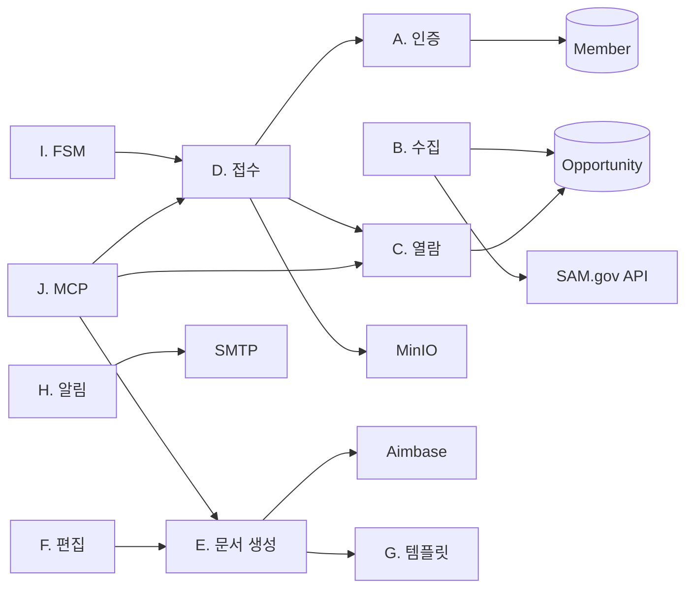
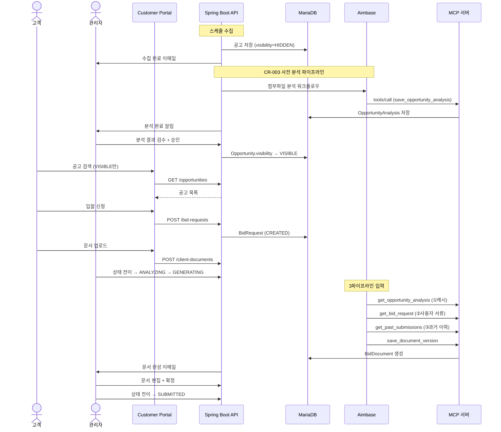

# 실행 지시서: SAM.gov Bidding Agency Platform

> 설계 버전: 1.1 | 최종 수정: 2026-03-28 | 관련 CR: CR-003

> **프로젝트:** bidding-agency-platform (미군 조달 입찰 AI 대행 서비스)
> **프로젝트 유형:** 풀스택 (BE: Java 17 + Spring Boot 3.2 / FE: React 19 × 2)
> **버전:** v1
> **최종 갱신:** 2026-03-19
>
> 이 문서는 **실행 지시서**입니다.
> Claude Code는 CLAUDE.md → 이 문서 → 해당 Sprint 참조 파일 순서로 읽습니다.
> 각 산출물의 상세 내용은 개별 파일을 직접 참조하세요.

---

## 0. 프로젝트 개요

SAM.gov에 올라오는 미군(USFK) 조달 입찰 공고를 자동 수집하고, AI(Aimbase)가 제안서를 작성하며, 관리자가 검토 후 최종 제출하는 입찰 대행 서비스.

- **유형:** 풀스택 (BE + Customer Portal + Admin Console)
- **모듈:** 14개 | **기능:** 45개 (MVP 31) | **비즈니스 규칙:** 14개 | **정책:** 11개
- **핵심 설계 결정:** Aimbase MCP 서버 아키텍처 (이 플랫폼이 MCP 서버), 관리자 중심 운영 모델 (ADMIN + CUSTOMER 2역할)
- **연관 서비스:** SAM.gov API, Aimbase (LLM 오케스트레이션), MinIO (파일 스토리지)

---

## 1. 산출물 맵

### 1단계: 요구사항 분석

| 번호 | 산출물 | 파일명 | 요약 |
|------|--------|--------|------|
| T1-1 | 기능 요구사항 명세서 | `T1-1_기능요구사항_명세서.md` | 14모듈 45기능 (MVP 31 / later 14) |
| T1-2 | 모듈 요약 | `T1-2_모듈_요약.md` | 모듈별 기능 수/MVP/책임 |
| T1-3 | 비즈니스 규칙 | `T1-3_비즈니스_규칙.md` | 14개 불변 규칙 |
| T1-4 | 정책 정의 | `T1-4_정책_정의.md` | 11개 변경 가능 규칙 |
| T1-5 | FSM 상태 정의 | `T1-5_FSM_상태_정의.md` | BidRequest 9상태 + BidDocument 3상태 |
| T1-6 | 이벤트 계약 | `T1-6_이벤트_계약.md` | 내부 8개 + 외부 3개 이벤트 |
| T1-7 | Sprint 구조도 | `T1-7_Sprint_구조도.md` | 8 Sprint, 의존관계, 검증 기준 |
| T1-8 | 시스템 가이드 | `T1-8_시스템_가이드.md` | 비개발자용 시스템 설명 |

### 2단계: 아키텍처 설계

| 번호 | 산출물 | 파일명 | 요약 |
|------|--------|--------|------|
| T2-1 | 기술 스택 결정서 | `T2-1_기술스택_결정서.md` | BE/FE/AI 기술 선택과 이유 |
| T2-2 | CLAUDE.md | 프로젝트 루트 `CLAUDE.md` | 프로젝트 컨텍스트, 규칙, 테스트 전략 |

### 3단계: 상세 설계

| 번호 | 산출물 | 파일명 | 요약 |
|------|--------|--------|------|
| T3-1 | 데이터 모델 | `T3-1_데이터_모델.md` | 15 엔티티, 10 Enum |
| T3-2 | API 설계 | `T3-2_API_설계.md` | REST 51개 + MCP Tool 8개 |
| T3-3 | 화면 구조 (IA) | `T3-3_화면_구조.md` | Portal 11페이지 + Admin 8페이지 |
| T3-4 | 화면 상호작용 | `T3-4_화면_상호작용.md` | 4개 복잡 페이지 인터랙션 |
| T3-5 | 단위테스트 명세 | `T3-5_단위테스트_명세.md` | 74개 테스트 케이스 |

### 관리

| 번호 | 산출물 | 파일명 | 요약 |
|------|--------|--------|------|
| CR | 변경 이력 | `CR_변경_이력.md` | CR 목록 |

---

## 2. 기술 스택 요약

### 백엔드

| 영역 | 선택 | 비고 |
|------|------|------|
| 언어 | Java 17 | |
| 프레임워크 | Spring Boot 3.2 | |
| DB 접근 | Spring Data JPA + Hibernate | |
| DB | MariaDB 11.2 | |
| 캐시 | Redis 7.2 | |
| 인증 | JWT (HS256) | Access 15min + Refresh 7day |
| 이메일 | Spring Mail + Thymeleaf | |
| MCP | MCP Java SDK | JSON-RPC 2.0 |

### 프론트엔드

| 영역 | 선택 | 비고 |
|------|------|------|
| 프레임워크 | React 19 + TypeScript 5 | Vite 7 빌드 |
| 상태 관리 | Context API | AuthContext |
| UI 라이브러리 | Radix UI + Lucide Icons | |
| 스타일 | TailwindCSS 4.1 | |
| HTTP | Axios | |
| 에디터 | TipTap | 문서 편집 |

---

## 3. 모듈 총괄

| 모듈 | 기능 수 | 책임 | 외부 연동 |
|------|---------|------|----------|
| A. 인증 | 4 | 회원가입, 로그인, JWT 관리 | — |
| B. 공고 수집 | 8 | SAM.gov 수집 + **사전 분석 + 노출 관리** (CR-003) | SAM.gov API, **Aimbase** |
| C. 공고 열람 | 4 | 검색, 상세, 필요 문서, 북마크 | — |
| D. 입찰 접수 | 4 | 신청, 문서 업로드, 현황 조회 | MinIO |
| E. 문서 생성 (AI) | 3 | AI 제안서 생성, 버전 관리 | Aimbase |
| F. 문서 편집 | 3 | 관리자 편집, 잠금, PDF | — |
| G. 템플릿 | 2 | 문서 양식 CRUD | — |
| H. 알림 | 2 | 이메일 발송, 마감 알림 | SMTP |
| I. FSM | 1 | 상태 전이 관리 | — |
| J. MCP 서버 | 4 | Aimbase 연동 Tool | Aimbase |
| K. 자격 진단 | 2 | AI 사전 진단 | Aimbase |
| L. 요금 | 2 | 요금 안내 | — |
| M. 관리자 | 4 | 회원/입찰/수집/**공고** 관리 (CR-003) | — |
| N. 인증 가이드 | 1 | 정적 가이드 페이지 | — |

---

## 4. 데이터 모델 요약

> 상세: `docs/T3-1_데이터_모델.md`

- **엔티티 16개**: Member, Opportunity, OpportunityAttachment, **OpportunityAnalysis** (CR-003), OpportunityRequirementItem, BidRequest, ClientDocument, BidDocument, BidDocumentVersion, DocumentTemplate, RequirementFulfillmentMap, Bookmark, NotificationLog, CollectorRun, KeywordGroup, EventLog
- **FSM 관리 엔티티**: BidRequest (9상태), BidDocument (3상태), **Opportunity (2상태: HIDDEN/VISIBLE)**, **OpportunityAnalysis (4상태)** (CR-003)
- **핵심 원칙**: UUID PK, JSON 컬럼(stateHistory, rawJson, contentJson), 문서 버전 불변성, 콘텐츠 해시 중복 검출

---

## 5. Sprint별 참조 가이드

### Sprint 1: 프로젝트 세팅 + 인증

**목표:** 프로젝트 구조 정리, DB 마이그레이션, 회원가입/로그인 구현
**기능:** 5개 (작업 1-1, 1-2, BID-AUTH-001~003)

#### BE 참조

| 순서 | 읽을 파일 | 참조 범위 |
|------|----------|----------|
| 1 | `CLAUDE.md` | BE 아키텍처 규칙, 네이밍 |
| 2 | `docs/T3-1_데이터_모델.md` | Member, Role Enum |
| 3 | `docs/T1-1_기능요구사항_명세서.md` | BID-AUTH-001~003 |
| 4 | `docs/T1-3_비즈니스_규칙.md` | BIZ-008 (이메일 유일성) |
| 5 | `docs/T3-2_API_설계.md` | A. 인증 API |
| 6 | `docs/T3-5_단위테스트_명세.md` | TC-AUTH-001~008 |
| 7 | `docs/T1-7_Sprint_구조도.md` | Sprint 1 검증 기준 |

#### FE 참조

| 순서 | 읽을 파일 | 참조 범위 |
|------|----------|----------|
| 1 | `CLAUDE.md` | FE 아키텍처 규칙 |
| 2 | `docs/T3-3_화면_구조.md` | 홈, 로그인, 회원가입, 프로필 |
| 3 | `docs/T3-2_API_설계.md` | A. 인증 API |
| 4 | `docs/T1-7_Sprint_구조도.md` | Sprint 1 FE 검증 기준 |

**핵심 설계 결정:**
- Role을 ADMIN + CUSTOMER 2개로 단순화. Flyway 마이그레이션으로 기존 역할 정리
- JWT HS256: Access 15min + Refresh 7day
- 회원가입 시 기본 역할은 CUSTOMER

**핵심 검증:** 회원가입 → DB 저장 → JWT 발급 → 인증 필요 API 호출 성공

---

### Sprint 2: 공고 수집 + 알림 + 사전 분석 (CR-003 확장)

**전제:** Sprint 1 완료
**기능:** 8개 (BID-OPP-001~008, BID-NOTIFY-001) — CR-003으로 BID-OPP-006~008 추가

#### BE 참조

| 순서 | 읽을 파일 | 참조 범위 |
|------|----------|----------|
| 1 | `CLAUDE.md` | BE 규칙 |
| 2 | `docs/T3-1_데이터_모델.md` | Opportunity, OpportunityAttachment, **OpportunityAnalysis (CR-003)**, CollectorRun, KeywordGroup, NotificationLog |
| 3 | `docs/T1-1_기능요구사항_명세서.md` | BID-OPP-001~005, **BID-OPP-006~008 (CR-003)**, BID-NOTIFY-001 |
| 4 | `docs/T1-3_비즈니스_규칙.md` | BIZ-004 (원본 보존), BIZ-005 (중복 검출), BIZ-012 (알림 멱등) |
| 5 | `docs/T1-4_정책_정의.md` | POL-001 (수집 주기), POL-002 (알림 대상) |
| 6 | `docs/T1-6_이벤트_계약.md` | OpportunitiesCollected, AttachmentDownloaded |
| 7 | `docs/T3-2_API_설계.md` | B. 공고 수집 API |
| 8 | `docs/T3-5_단위테스트_명세.md` | TC-OPP, TC-ATT, TC-NOTI |
| 9 | `docs/T1-7_Sprint_구조도.md` | Sprint 2 검증 기준 |

**핵심 설계 결정:**
- SAM.gov API 호출은 cron 4회/일 + 수동 트리거
- 원본 JSON은 rawJson 필드에 보존 (BIZ-004)
- 이메일 발송은 Thymeleaf HTML 템플릿 사용
- 알림 중복 방지: idempotencyKey 기반
- **(CR-003)** 첨부파일 다운로드 완료 → 자동 사전 분석 트리거 (Aimbase 워크플로우)
- **(CR-003)** 관리자 수동 첨부파일 업로드 → 사전 분석 트리거
- **(CR-003)** Opportunity.visibility: HIDDEN(기본) → 관리자 승인 → VISIBLE (사용자 노출)

**핵심 검증:** cron 수집 → DB 저장 → 중복 검출 → 첨부 다운로드 → **사전 분석 자동 트리거** → 관리자 이메일 수신 → **관리자 승인 → 사용자 노출**

---

### Sprint 3: 공고 열람 + 자격 진단

**전제:** Sprint 2 완료
**기능:** 5개 (BID-BROWSE-001~004, BID-QUAL-001~002)

#### BE 참조

| 순서 | 읽을 파일 | 참조 범위 |
|------|----------|----------|
| 1 | `CLAUDE.md` | BE 규칙 |
| 2 | `docs/T3-1_데이터_모델.md` | Opportunity, OpportunityRequirementItem, Bookmark |
| 3 | `docs/T1-1_기능요구사항_명세서.md` | BID-BROWSE, BID-QUAL |
| 4 | `docs/T3-2_API_설계.md` | C. 공고 열람, D. 즐겨찾기, E. 자격 진단 |
| 5 | `docs/T3-5_단위테스트_명세.md` | TC-BROWSE, TC-BM |

#### FE 참조

| 순서 | 읽을 파일 | 참조 범위 |
|------|----------|----------|
| 1 | `CLAUDE.md` | FE 규칙 |
| 2 | `docs/T3-3_화면_구조.md` | 공고 검색, 공고 상세, 즐겨찾기, 가이드 |
| 3 | `docs/T3-4_화면_상호작용.md` | 공고 상세 — 입찰 신청 (자격 진단 부분) |
| 4 | `docs/T3-2_API_설계.md` | C, D, E API |

**핵심 검증:** 공고 목록 페이징/검색/필터 → 상세 + 요구사항 + 첨부 → 북마크 토글

---

### Sprint 4: 입찰 접수 + FSM

**전제:** Sprint 3 완료
**기능:** 7개 (BID-REQ-001~004, BID-FSM-001, BID-PRICE-002, BID-NOTIFY-002)

#### BE 참조

| 순서 | 읽을 파일 | 참조 범위 |
|------|----------|----------|
| 1 | `CLAUDE.md` | BE 규칙 |
| 2 | `docs/T3-1_데이터_모델.md` | BidRequest, ClientDocument, ServiceLevel Enum, BidRequestState Enum |
| 3 | `docs/T1-5_FSM_상태_정의.md` | BidRequest 전체 FSM |
| 4 | `docs/T1-3_비즈니스_규칙.md` | BIZ-001 (FSM 화이트리스트), BIZ-006 (중복 신청), BIZ-011 (파일 크기) |
| 5 | `docs/T1-6_이벤트_계약.md` | BidRequestCreated, BidRequestStateChanged, DocumentsReceived, DeadlineApproaching |
| 6 | `docs/T3-2_API_설계.md` | F. 입찰 접수, G. 고객 문서 제출, H. 입찰 관리 |
| 7 | `docs/T3-5_단위테스트_명세.md` | TC-BID, TC-FSM, TC-DOC-UPLOAD, TC-DEADLINE |

#### FE 참조

| 순서 | 읽을 파일 | 참조 범위 |
|------|----------|----------|
| 1 | `CLAUDE.md` | FE 규칙 |
| 2 | `docs/T3-3_화면_구조.md` | 내 입찰 현황, 입찰 상세, 대시보드, 입찰 관리 |
| 3 | `docs/T3-4_화면_상호작용.md` | 공고 상세 입찰 신청, 입찰 상세 문서 업로드, 입찰 상세 관리 |
| 4 | `docs/T3-2_API_설계.md` | F, G, H API |

**핵심 설계 결정:**
- FSM 화이트리스트: 허용 전이만 실행, 나머지 전부 거부
- 동일 공고 중복 신청 방지: (member_id, opportunity_id) UNIQUE 제약
- 마감 알림: D-7, D-3, D-1 스케줄러

**핵심 검증:** 신청 → CREATED → DOCS_PENDING → 문서 업로드 → DOCS_RECEIVED → 전체 FSM 전이 테스트

---

### Sprint 5: MCP 서버 + Aimbase 연동 (CR-002 갱신)

**전제:** Sprint 4 완료
**기능:** 6개 (BID-MCP-001~005, 작업 5-1)

#### BE 참조

| 순서 | 읽을 파일 | 참조 범위 |
|------|----------|----------|
| 1 | `CLAUDE.md` | BE 규칙, AI 연동 섹션 |
| 2 | `docs/T3-2_API_설계.md` | MCP 서버 전체 + Aimbase 워크플로우 호출 |
| 3 | `docs/T1-1_기능요구사항_명세서.md` | BID-MCP-001~005 |
| 4 | `docs/T1-3_비즈니스_규칙.md` | BIZ-013 (MCP 무상태) |
| 5 | `docs/T3-5_단위테스트_명세.md` | TC-MCP 전체 |

**핵심 설계 결정 (CR-002):**
- MCP 전송: HTTP POST (`POST /mcp`) + **SSE** (`GET /mcp/sse` + `POST /mcp/message`) 이중 지원
- 11개 Tool (기존 8개 + CR-003 신규 3개: get_opportunity_analysis, save_opportunity_analysis, get_past_submissions)
- McpDispatcher 추출 → HTTP/SSE 공유
- LLMPlatformClient: `localhost:9000` → Aimbase `14.63.25.49:8280`, `X-API-Key` 인증 추가
- AIWorkflowService: 후처리 저장 로직 제거 (Aimbase MCP 콜백으로 대체)
- 순환 트리거 방지 가드 추가

**핵심 검증:**
1. Aimbase 연결 확인 (LLMPlatformClient.isHealthy())
2. Aimbase에서 SSE로 MCP 서버 등록 → discover → 11개 Tool 목록 확인
3. 워크플로우 실행 → MCP 콜백 → 데이터 저장 확인
4. Aimbase 셋업 스크립트 실행 (Connection, MCP Server, Workflow 생성)

---

### Sprint 6: 문서 생성 + 템플릿

**전제:** Sprint 5 완료
**기능:** 5개 (BID-TPL-001~002, BID-DOC-001~003)

#### BE 참조

| 순서 | 읽을 파일 | 참조 범위 |
|------|----------|----------|
| 1 | `CLAUDE.md` | BE 규칙 |
| 2 | `docs/T3-1_데이터_모델.md` | DocumentTemplate, BidDocument, BidDocumentVersion |
| 3 | `docs/T1-3_비즈니스_규칙.md` | BIZ-002 (버전 불변), BIZ-010 (사용 중 템플릿 삭제 불가) |
| 4 | `docs/T1-6_이벤트_계약.md` | DocumentGenerated, AimbaseWorkflowCompleted |
| 5 | `docs/T3-2_API_설계.md` | I. 문서 템플릿 |
| 6 | `docs/T3-5_단위테스트_명세.md` | TC-TPL, TC-DOCGEN |

#### FE 참조

| 순서 | 읽을 파일 | 참조 범위 |
|------|----------|----------|
| 1 | `docs/T3-3_화면_구조.md` | 문서 양식 관리 |
| 2 | `docs/T3-2_API_설계.md` | I. 템플릿 API |

**핵심 설계 결정 (CR-003):**
- BID-DOC-001 LLM 입력 3파이프라인: ①OpportunityAnalysis(캐시) + ②ClientDocument[] + ③과거 BidDocument[]
- 과거 이력은 조회해서 넘기면 끝. 빈 배열이어도 동일 구조. 조건 분기 없음
- 사전 분석이 COMPLETED 상태여야 문서 생성 가능

**핵심 검증:** 템플릿 등록 → **사전 분석 캐시 확인** → Aimbase Workflow 실행 (3파이프라인 입력) → 문서 생성 → DB 저장 → 관리자 이메일

---

### Sprint 7: 문서 편집 + 서비스 요금

**전제:** Sprint 6 완료
**기능:** 5개 (BID-EDIT-001~003, BID-PRICE-001, BID-ADMIN-003)

#### BE 참조

| 순서 | 읽을 파일 | 참조 범위 |
|------|----------|----------|
| 1 | `docs/T3-1_데이터_모델.md` | BidDocument, BidDocumentVersion |
| 2 | `docs/T1-5_FSM_상태_정의.md` | BidDocument FSM |
| 3 | `docs/T1-3_비즈니스_규칙.md` | BIZ-002, BIZ-003, BIZ-009 |
| 4 | `docs/T1-6_이벤트_계약.md` | DocumentConfirmed |
| 5 | `docs/T3-2_API_설계.md` | J. 문서 편집, L. 요금 안내 |
| 6 | `docs/T3-5_단위테스트_명세.md` | TC-EDIT |

#### FE 참조

| 순서 | 읽을 파일 | 참조 범위 |
|------|----------|----------|
| 1 | `docs/T3-3_화면_구조.md` | 문서 편집, 요금 안내 |
| 2 | `docs/T3-4_화면_상호작용.md` | 문서 편집 페이지 전체 |
| 3 | `docs/T3-2_API_설계.md` | J, L API |

**핵심 검증:** TipTap 편집 → 새 버전 → 잠금 → 잠금 해제 → PDF 내보내기

---

### Sprint 8: 통합 테스트 + 안정화

**전제:** Sprint 7 완료
**기능:** 4개 (작업 8-1~8-4)

| 순서 | 읽을 파일 | 참조 범위 |
|------|----------|----------|
| 1 | 전체 설계 문서 | E2E 플로우 검증 |
| 2 | `docs/T1-5_FSM_상태_정의.md` | 전체 FSM 전이 검증 |
| 3 | `docs/T1-6_이벤트_계약.md` | 이벤트 흐름 검증 |

**핵심 검증:** 공고 수집 → 입찰 신청 → 문서 제출 → AI 생성 → 편집 → 확정 → 제출 전체 플로우

---

## 5-A. 구현 세션 분리 전략

**선택한 전략:** 옵션 A — Sprint 단위 BE/FE 분리

각 Sprint에서 BE를 먼저 구현하고, BE API가 완성되면 FE를 연동.

---

## 5-B. Git 브랜치 전략

### 브랜치 구조

| 브랜치 | 역할 | 보호 |
|--------|------|------|
| `main` | 운영 배포 가능 상태 | PR 머지만 허용 |
| `develop` | 개발 통합 | PR 머지 권장 |
| `feat/SPR-{N}-{기능명}` | Sprint 작업 | develop에 PR |

### 커밋 메시지 형식

`<type>: <설명>` — type: feat / fix / refactor / docs / chore / ui

---

## 6. 핵심 아키텍처 원칙

1. **FSM 화이트리스트** — 허용 전이 외 전면 차단 (BIZ-001)
2. **문서 버전 불변성** — 수정 시 새 버전 생성, 기존 불변 (BIZ-002)
3. **MCP 무상태** — Tool 호출 독립 처리, requestId 멱등 (BIZ-013)
4. **알림 멱등성** — idempotencyKey로 중복 발송 방지 (BIZ-012)
5. **원본 보존** — SAM.gov rawJson 변경 금지 (BIZ-004)

---

## 7. Sprint 의존관계 다이어그램

```
Sprint 1 (인증)
    │
    ▼
Sprint 2 (수집 + 알림)
    │
    ▼
Sprint 3 (열람 + 진단)
    │
    ▼
Sprint 4 (접수 + FSM)
    │
    ▼
Sprint 5 (MCP + Aimbase)
    │
    ▼
Sprint 6 (문서 생성)
    │
    ▼
Sprint 7 (편집 + 요금)
    │
    ▼
Sprint 8 (통합 테스트)
```

---

## 8. 설계 리뷰 시트

### 8-1. 모듈 관계도



### 8-2. 핵심 데이터 흐름



### 8-3. 화면 - API 매핑 요약

| 화면 | 주요 API | 비고 |
|------|---------|------|
| 홈 | — | 정적 콘텐츠 |
| 공고 검색 | `GET /opportunities`, `/search`, `/near-deadline` | 필터, 페이징 |
| 공고 상세 | `GET /opportunities/{id}`, `/requirements`, `/attachments` | |
| 입찰 신청 | `POST /bid-requests` | 서비스 레벨 선택 |
| 내 입찰 현황 | `GET /bid-requests/my`, `/{id}`, `/{id}/history` | |
| 문서 업로드 | `POST /bid-requests/{id}/client-documents` | multipart |
| 즐겨찾기 | `GET/POST/DELETE /bookmarks/{id}` | |
| Admin 대시보드 | `GET /admin/bid-requests/stats` | |
| Admin 입찰 관리 | `GET/POST /admin/bid-requests/*` | FSM 전이 |
| Admin 문서 편집 | `GET/POST /bid-documents/{id}/*` | TipTap + 잠금 |
| Admin 수집 관리 | `POST /admin/collection/trigger` | |
| **Admin 공고 관리** | `GET/POST /admin/opportunities/*` | **CR-003**: 첨부 업로드, 분석, 승인 |
| Admin 양식 관리 | `GET/POST/DELETE /admin/document-templates` | |

### 8-4. 리뷰 체크리스트

- [ ] 모듈 관계도에서 빠진 의존관계가 없는가?
- [ ] 데이터 흐름에서 누락된 단계가 없는가?
- [ ] 모든 화면이 필요한 API를 호출하고 있는가?
- [ ] FSM 상태 전이가 T1-5과 일치하는가?
- [ ] 이벤트 발행/수신이 T1-6과 일치하는가?
- [ ] MCP Tool 목록이 T3-2와 일치하는가?
- [ ] 비즈니스 규칙(T1-3)이 테스트 케이스(T3-5)에 반영되었는가?
